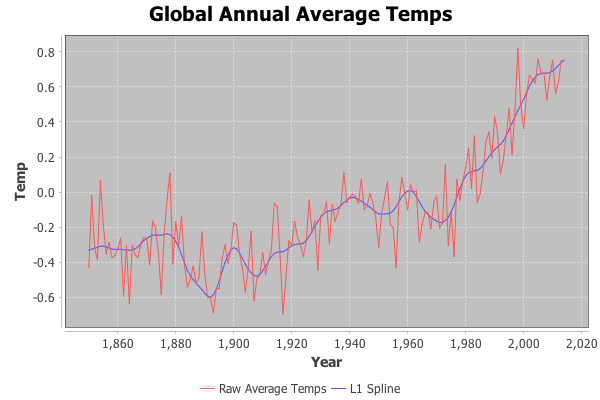
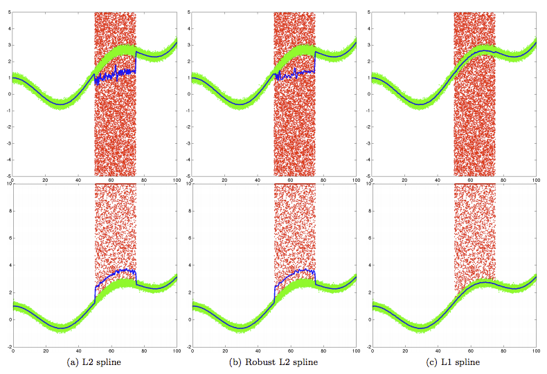
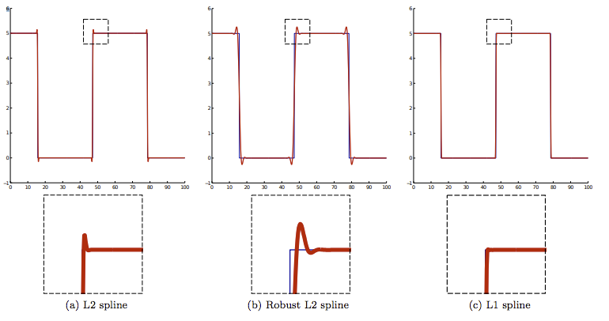

*A Java Implementation of an L1-Regularized Spline Process*

Typically splines for noisy signal reconstruction are regularized with
a weighted L2 term. Tepper and Sapiro[1] describe an efficient
numerical scheme for using an L1 term instead, yielding better
robustness to outliers.

I have implemented the described algorithm in Java, using the
[ND4J](https://nd4j.org/index.html) library, which uses a BLAS backend
for matrix computations, and can also be configured to use a CUDA
backend for offloading computation onto fast graphics card hardware.

Effectively this code presents an efficient API for a more robust
L1-based spline processing of signals to the JVM, suitable for
JVM-based applications running on servers, gpus, desktops, or even
Android phones.

The chart above shows a spline generated by this code with L1
regularization on annual global temperature data from the Met Office
Hadley Centre.[2] _Note that the dataset itself has been deprecated by
the center and is only used here as an illustration of the
implementation of the algorithm._

**Motivation for L1 Regularization**

Both L1 and L2 regularization seek to reduce overfitting by
constraining the model. L2 penalizes the squared magnitude of the
error, while L1, based on LASSO (Low Absolute Shrinkage and Selection
Operator) penalizes the absolute value of the error. In L2, the closer
an error term gets to zero the less it is penalized, so terms aren't
ever completely zeroed out. In L1, terms shrink linearly, and so they
can be brought to zero. L1 has the benefit of both preventing
overfitting and lowering the number of non-zero terms in the
model. Lowering the number of non-zero terms can sometimes be an aid
in reducing computation, and also can aid feature extraction.

This explains the differences you see in figure above (from [1]), for
example. While L2 reduces the effects of outliers, it cannot be
completely uninfluenced by them. L1 actually can bring that influence
down to zero in certain circumstances.

It also explains the lack of ringing in figure above (from [1]) -
while L2 doesn't care about small errors (or rather, it only cares a
little about small errors), L1 cares about all errors equally, and
seeks to bring small errors to zero.

[1]: Mariano Tepper and Guillermo Sapiro. L1 Splines for Robust, Simple, and Fast Smoothing of Grid Data. _CoRR_, 1208.2292, 2012.

[2]: P. Brohan, J. J. Kennedy, I. Harris, S. F. B. Tett, and P. D. Jones. Uncertainty estimates in regional and global observed temperature changes: A new data set from 1850. _Journal of Geophisical Research, 111(D12):D12106+, June 2006.

